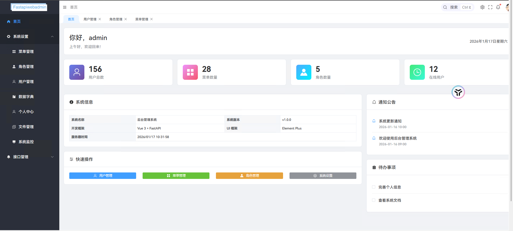
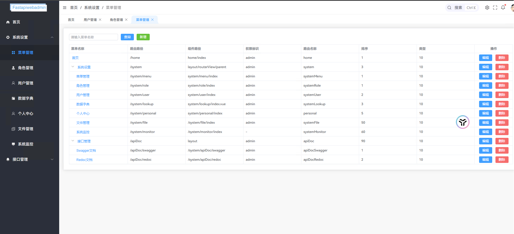
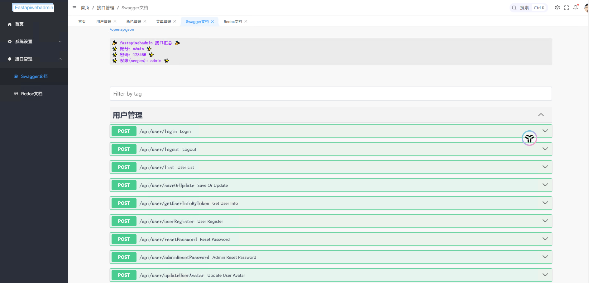
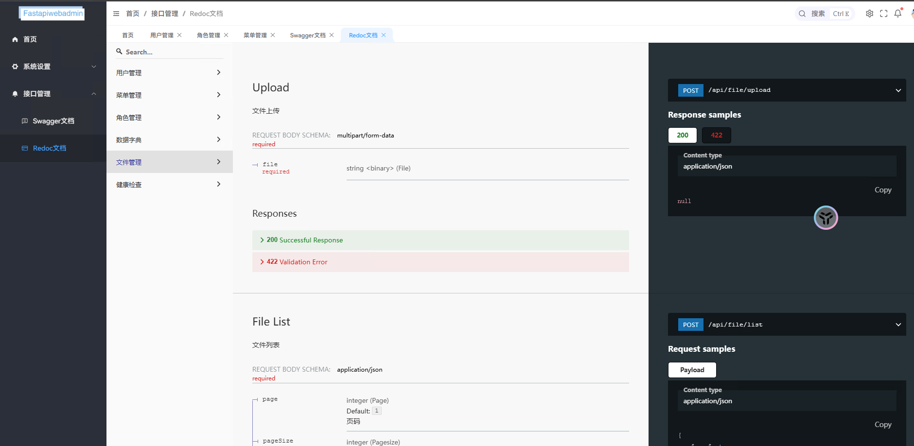
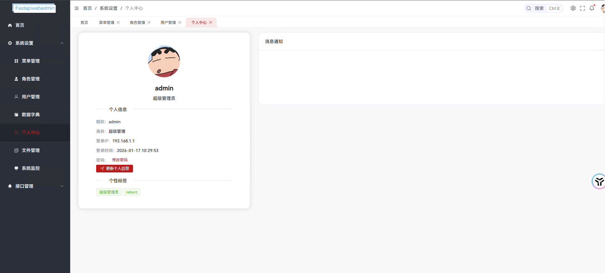
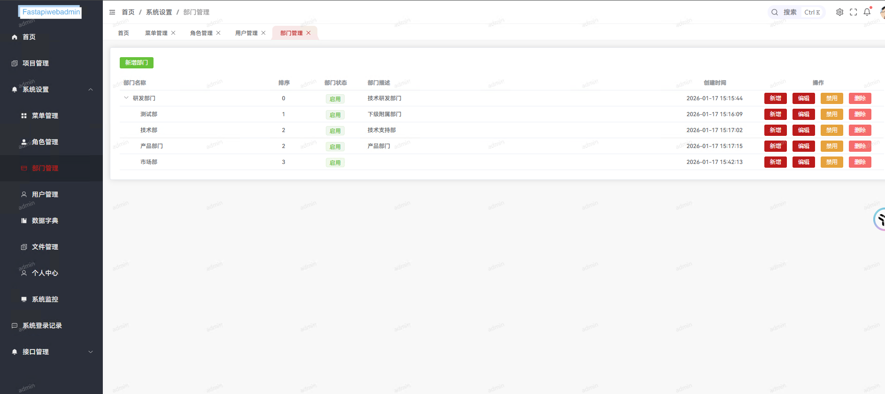
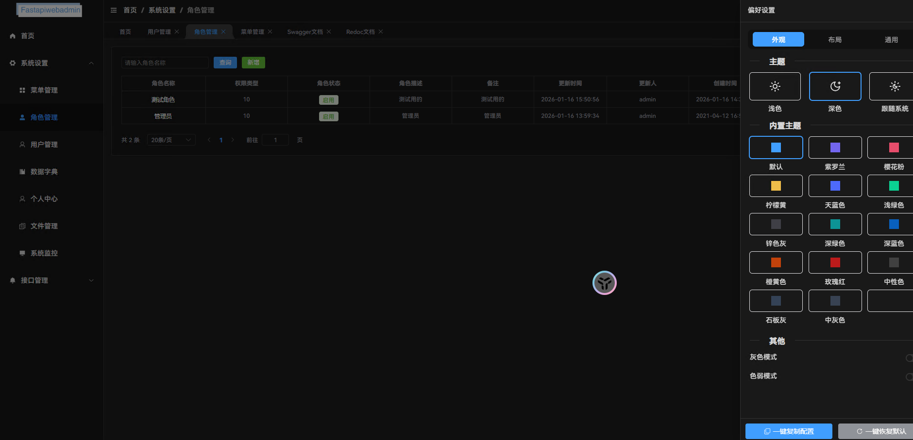
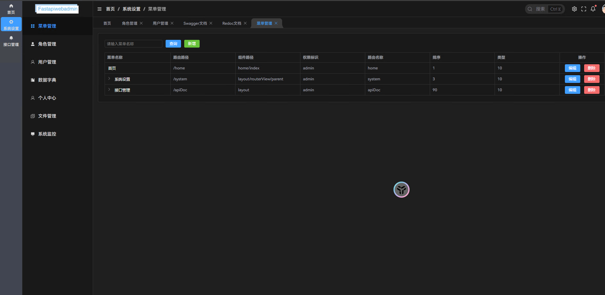
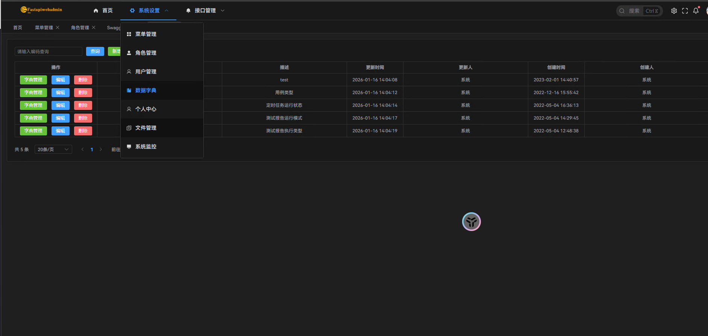

# FastAPI Web Admin

<div align="center">

**基于 FastAPI + Vue3 的现代化企业级后台管理系统**

一个开箱即用的前后端分离管理平台，内置完整的 RBAC 权限系统、数据权限控制和动态路由机制

[](https://www.python.org/)
[](https://fastapi.tiangolo.com/)
[](https://vuejs.org/)
[](LICENSE)

</div>

---

## 🌈 项目介绍

FastAPI Web Admin 是一个面向企业级应用的现代化后台管理系统脚手架，采用前后端完全分离的架构设计。

**核心特性：**
- 🚀 开箱即用，快速搭建企业后台系统
- 🔐 完整的 RBAC 权限管理体系（角色-权限-菜单-数据权限）
- 🎯 动态路由注册，配置即可分配权限
- 🛡️ 多层级权限控制（菜单权限、按钮权限、数据权限、API权限）
- 📊 完善的日志管理系统（登录日志、操作日志）
- 🎨 支持主题切换和暗黑模式
- 📦 Docker 一键部署
- ⚡ 异步高性能架构
- 🛠️ 开发者友好，专注业务逻辑

---

## 📋 技术栈

### 环境要求

| 技术 | 版本 | 说明 |
|------|------|------|
| Python | ≤ 3.13 | 后端运行环境 |
| Node.js | 18.15.0 | 前端构建环境 |
| MySQL | 8.0.23 | 主数据库 |
| Redis | 6.0.9 | 缓存和任务队列 |

### 后端技术栈

| 技术 | 版本 | 用途 |
|------|------|------|
| FastAPI | 0.111.0 | 异步 Web 框架 |
| SQLAlchemy | 2.0.3 | 异步 ORM |
| Pydantic | 2.7.3 | 数据验证 |
| Alembic | 1.13.1 | 数据库迁移 |
| Celery | 5.2.7 | 异步任务队列 |
| Redis | 5.0.4 | 缓存和消息队列 |
| Loguru | 0.6.0 | 日志系统 |
| python-jose | 3.3.0 | JWT 认证 |
| asyncmy | 0.2.9 | 异步 MySQL 驱动 |

### 前端技术栈

| 技术 | 版本 | 用途 |
|------|------|------|
| Vue | 3.5.8 | 渐进式框架 |
| Vite | 5.4.8 | 构建工具 |
| TypeScript | 4.9.4 | 类型系统 |
| Element Plus | 2.7.4 | UI 组件库 |
| Pinia | 2.0.28 | 状态管理 |
| Vue Router | 4.1.6 | 路由管理 |
| Axios | 1.2.1 | HTTP 客户端 |
| Monaco Editor | 0.34.1 | 代码编辑器 |

---

## 🏗️ 系统架构

### 整体架构图

```
┌─────────────────────────────────────────────────────────────┐
│                         用户层                               │
│                    (浏览器 / 移动端)                         │
└────────────────────────┬────────────────────────────────────┘
                         │
                         ▼
┌─────────────────────────────────────────────────────────────┐
│                      前端层 (Vue 3)                          │
│  ┌──────────┐  ┌──────────┐  ┌──────────┐  ┌──────────┐   │
│  │  路由    │  │  状态    │  │  组件    │  │  指令    │   │
│  │ Router   │  │  Pinia   │  │ Element  │  │ 权限控制 │   │
│  └──────────┘  └──────────┘  └──────────┘  └──────────┘   │
└────────────────────────┬────────────────────────────────────┘
                         │ HTTP/HTTPS
                         ▼
┌─────────────────────────────────────────────────────────────┐
│                   API 网关层 (FastAPI)                       │
│  ┌──────────┐  ┌──────────┐  ┌──────────┐  ┌──────────┐   │
│  │  认证    │  │  限流    │  │  日志    │  │  异常    │   │
│  │ 中间件   │  │ 中间件   │  │ 中间件   │  │  处理    │   │
│  └──────────┘  └──────────┘  └──────────┘  └──────────┘   │
└────────────────────────┬────────────────────────────────────┘
                         │
                         ▼
┌─────────────────────────────────────────────────────────────┐
│                    业务逻辑层 (Services)                     │
│  ┌──────────┐  ┌──────────┐  ┌──────────┐  ┌──────────┐   │
│  │  用户    │  │  角色    │  │  菜单    │  │  权限    │   │
│  │ 服务     │  │ 服务     │  │ 服务     │  │  服务    │   │
│  └──────────┘  └──────────┘  └──────────┘  └──────────┘   │
└────────────────────────┬────────────────────────────────────┘
                         │
                         ▼
┌─────────────────────────────────────────────────────────────┐
│                  数据访问层 (SQLAlchemy)                     │
│  ┌──────────┐  ┌──────────┐  ┌──────────┐  ┌──────────┐   │
│  │  Models  │  │ Schemas  │  │  会话    │  │  事务    │   │
│  │  定义    │  │  验证    │  │  管理    │  │  管理    │   │
│  └──────────┘  └──────────┘  └──────────┘  └──────────┘   │
└────────────────────────┬────────────────────────────────────┘
                         │
         ┌───────────────┴───────────────┬──────────────┐
         ▼                               ▼              ▼
┌──────────────────┐          ┌──────────────┐  ┌─────────────┐
│   MySQL 8.0      │          │  Redis 6.0   │  │   Celery    │
│   主数据库       │          │  缓存/队列   │  │  任务队列   │
└──────────────────┘          └──────────────┘  └─────────────┘
```

### 后端分层架构

```
backend/
├── app/
│   ├── api/               # API 路由层 - 处理 HTTP 请求
│   │   ├── v1/            # API 版本控制
│   │   │   ├── system/    # 系统管理模块
│   │   │   │   ├── auth/  # 认证授权
│   │   │   │   ├── user/  # 用户管理
│   │   │   │   ├── role/  # 角色管理
│   │   │   │   ├── menu/  # 菜单管理
│   │   │   │   ├── dept/  # 部门管理
│   │   │   │   ├── permission/ # 权限管理
│   │   │   │   ├── log/   # 日志管理
│   │   │   │   └── file/  # 文件管理
│   │   │   ├── business/  # 业务模块
│   │   │   ├── monitor/   # 监控模块
│   │   │   └── common/    # 公共模块
│   │   └── __init__.py    # 路由注册
│   │
│   ├── core/              # 核心功能层
│   │   ├── base_crud.py   # 基础 CRUD 操作
│   │   ├── base_model.py  # 基础模型
│   │   ├── base_schema.py # 基础 Schema
│   │   ├── permission.py  # 权限控制核心
│   │   ├── data_permission.py # 数据权限过滤
│   │   └── api_permission.py  # API权限控制
│   │
│   ├── models/            # 数据模型层 - ORM 模型定义
│   │   ├── rbac_models.py # RBAC 权限模型
│   │   ├── system_models.py # 系统模型
│   │   ├── api_models.py  # API 模型
│   │   └── base.py        # 基础模型
│   │
│   ├── schemas/           # 数据验证层 - Pydantic 模型
│   │   ├── base.py        # 基础 Schema
│   │   ├── common.py      # 公共 Schema
│   │   └── __init__.py    # Schema 导出
│   │
│   ├── db/                # 数据库配置
│   │   ├── sqlalchemy.py  # 数据库连接和会话管理
│   │   ├── redis.py       # Redis 连接配置
│   │   └── __init__.py    # 数据库初始化
│   │
│   ├── corelibs/          # 核心库
│   │   ├── codes.py       # 状态码定义
│   │   ├── consts.py      # 常量定义
│   │   ├── logger.py      # 日志配置
│   │   ├── local.py       # 本地存储
│   │   └── custom_router.py # 自定义路由
│   │
│   ├── utils/             # 工具函数
│   │   ├── common.py      # 通用工具
│   │   ├── security.py    # 安全工具
│   │   ├── current_user.py # 当前用户获取
│   │   ├── response.py    # 响应工具
│   │   └── serialize.py   # 序列化工具
│   │
│   ├── exceptions/        # 异常处理
│   │   ├── exceptions.py  # 自定义异常
│   │   └── __init__.py    # 异常导出
│   │
│   ├── init/              # 初始化模块
│   │   ├── cors.py        # 跨域配置
│   │   ├── exception.py   # 异常处理器
│   │   ├── middleware.py  # 中间件配置
│   │   ├── routers.py     # 路由初始化
│   │   └── __init__.py    # 初始化导出
│   │
│   ├── middleware/        # 中间件
│   │   ├── log_middleware.py # 日志中间件
│   │   └── __init__.py    # 中间件导出
│   │
│   └── common/            # 公共模块
│       ├── constants.py   # 常量定义
│       ├── enums.py       # 枚举定义
│       ├── response.py    # 响应模型
│       └── __init__.py    # 公共模块导出
│
├── celery_worker/         # Celery 任务
│   ├── tasks/             # 任务定义
│   ├── scheduler/         # 定时任务调度器
│   ├── worker.py          # Worker 配置
│   └── base.py            # 基础配置
│
├── tests/                 # 测试文件
│   ├── conftest.py        # 测试配置
│   ├── test_health.py     # 健康检查测试
│   └── __init__.py        # 测试初始化
│
├── alembic/               # 数据库迁移
│   ├── versions/          # 迁移版本
│   ├── env.py             # 迁移环境配置
│   └── script.py.mako     # 迁移脚本模板
│
├── static/                # 静态文件
│   ├── upload/            # 上传文件
│   ├── assets/            # 资源文件
│   └── swagger/           # API 文档资源
│
├── scripts/               # 脚本文件
│   ├── REFACTORING_PLAN.md # 重构计划
│   └── *.md               # 其他文档
│
├── config.py              # 配置文件
├── main.py                # 应用入口
├── start.py               # 启动脚本
├── cli.py                 # CLI 工具
├── init_permissions_simple.py # 权限初始化
└── requirements           # 依赖文件
```

### 前端目录架构

```
frontend/src/
├── api/                   # API 接口封装
│   ├── v1/                # API 版本控制
│   │   ├── system/        # 系统管理接口
│   │   │   ├── user.ts    # 用户接口
│   │   │   ├── role.ts    # 角色接口
│   │   │   ├── menu.ts    # 菜单接口
│   │   │   ├── dept.ts    # 部门接口
│   │   │   ├── permission.ts # 权限接口
│   │   │   ├── log.ts     # 日志接口
│   │   │   └── file.ts    # 文件接口
│   │   ├── monitor/       # 监控接口
│   │   └── common/        # 公共接口
│   └── request.ts         # 请求封装
│
├── components/            # 公共组件
│   ├── Z-Table/           # 表格组件
│   ├── iconSelector/      # 图标选择器
│   ├── monaco/            # 代码编辑器
│   ├── seePictures/       # 图片预览
│   ├── svgIcon/           # SVG 图标
│   └── ZeroCard/          # 卡片组件
│
├── layout/                # 布局组件
│   ├── navBars/           # 导航栏
│   ├── navMenu/           # 菜单
│   ├── main/              # 主体内容
│   └── tagsView/          # 标签页
│
├── views/                 # 页面视图
│   ├── system/            # 系统管理
│   │   ├── user/          # 用户管理
│   │   ├── role/          # 角色管理
│   │   ├── menu/          # 菜单管理
│   │   ├── dept/          # 部门管理
│   │   ├── permission/    # 权限管理
│   │   ├── loginRecord/   # 登录日志
│   │   ├── operationLog/  # 操作日志
│   │   ├── file/          # 文件管理
│   │   ├── dic/           # 字典管理
│   │   ├── lookup/        # 查找表管理
│   │   ├── project/       # 项目管理
│   │   └── personal/      # 个人中心
│   ├── monitor/           # 系统监控
│   │   ├── online/        # 在线用户
│   │   └── server/        # 服务器监控
│   ├── home/              # 首页
│   ├── login/             # 登录页
│   └── error/             # 错误页面
│
├── router/                # 路由配置
│   ├── index.ts           # 路由入口
│   ├── route.ts           # 路由定义
│   └── backEnd.ts         # 后端路由处理
│
├── stores/                # Pinia 状态管理
│   ├── user.ts            # 用户状态
│   ├── auth.ts            # 认证状态
│   ├── menu.ts            # 菜单状态
│   ├── routesList.ts      # 路由状态
│   ├── tagsViewRoutes.ts  # 标签页状态
│   ├── themeConfig.ts     # 主题配置
│   └── index.ts           # 状态管理入口
│
├── directive/             # 自定义指令
│   ├── authDirective.ts   # 权限指令 v-auth
│   ├── clickOutside.ts    # 点击外部指令
│   └── index.ts           # 指令入口
│
├── utils/                 # 工具函数
│   ├── request.ts         # HTTP 请求封装
│   ├── authFunction.ts    # 权限验证函数
│   ├── common.ts          # 通用工具
│   ├── storage.ts         # 存储工具
│   ├── formatTime.ts      # 时间格式化
│   ├── config.ts          # 配置工具
│   └── other.ts           # 其他工具
│
├── types/                 # TypeScript 类型
│   ├── global.d.ts        # 全局类型
│   ├── views.d.ts         # 视图类型
│   ├── layout.d.ts        # 布局类型
│   └── axios.d.ts         # 请求类型
│
├── theme/                 # 主题配置
│   ├── index.scss         # 主题入口
│   ├── app.scss           # 应用样式
│   ├── dark.scss          # 暗色主题
│   ├── element.scss       # Element Plus 样式
│   └── common/            # 公共样式
│
├── icons/                 # 图标资源
│   ├── svg/               # SVG 图标
│   ├── iconify/           # Iconify 图标
│   └── index.ts           # 图标入口
│
├── config/                # 配置文件
│   └── assets.ts          # 资源配置
│
├── App.vue                # 根组件
└── main.ts                # 应用入口
```

---

## ✨ 核心特性

### 后端核心功能

#### 1. 异步高性能架构
- FastAPI 异步框架，支持高并发请求
- SQLAlchemy 2.0 异步 ORM，提升数据库操作性能
- Redis 异步连接池，优化缓存访问
- 异步 MySQL 驱动 (asyncmy)，提升数据库连接性能

#### 2. 完善的权限管理系统
- **RBAC 权限模型**：用户-角色-权限-菜单四层权限体系
- **菜单权限**：控制页面和菜单的显示权限
- **按钮权限**：精确控制页面内按钮的操作权限
- **数据权限**：支持5种数据范围（仅本人、本部门、本部门及以下、全部、自定义）
- **API权限**：接口级别的访问控制
- **权限装饰器**：`@DataPermission` 和 `@ApiPermission` 装饰器

#### 3. 完善的中间件系统
- **认证中间件**：JWT Token 验证和用户身份识别
- **日志中间件**：请求/响应日志记录，trace_id 追踪
- **限流中间件**：API 访问频率控制
- **异常中间件**：统一异常捕获和响应格式化

#### 4. 企业级日志管理
- **登录日志**：记录用户登录行为、IP地址、设备信息
- **操作日志**：记录用户操作行为、请求参数、响应结果
- **日志查询**：支持多条件查询、时间范围筛选
- **日志管理**：支持批量删除、定期清理功能

#### 5. 分层架构设计
- **API 层**：处理 HTTP 请求，参数验证
- **Core 层**：核心业务逻辑，权限控制
- **Models 层**：数据模型定义，数据库映射
- **Schemas 层**：数据验证，序列化/反序列化

#### 6. 任务队列系统
- Celery 异步任务处理
- Celery Beat 定时任务调度
- 数据库持久化任务状态
- 自定义调度器支持

#### 7. 数据库管理
- Alembic 数据库迁移
- 一键初始化脚本
- 自动生成迁移文件
- 支持多环境配置

#### 8. OAuth 第三方登录 🆕
- **8 个提供商支持**：Gitee、GitHub、QQ、Google、微信、Microsoft、钉钉、飞书
- **统一接口设计**：所有提供商使用相同的 API 接口
- **自动用户管理**：首次登录自动创建用户，重复登录自动更新信息
- **安全可靠**：CSRF 防护、授权码一次性使用、Token 加密存储
- **易于扩展**：基于抽象基类的设计模式，轻松添加新提供商
- **详细文档**：完整的实施计划、测试指南和快速启动文档

📖 **详细文档**: [OAuth 功能文档](./OAUTH_README.md)

### 前端核心功能

#### 1. 动态路由系统
- 后端配置菜单，前端自动注册路由
- 支持多级嵌套路由
- 路由懒加载，优化首屏性能
- 动态面包屑导航

#### 2. 多层级权限控制体系
- **路由级权限**：根据角色动态生成菜单
- **按钮级权限**：v-auth 指令控制按钮显示
- **接口级权限**：后端 API 权限验证
- **数据级权限**：根据用户权限过滤数据

#### 3. 完善的用户界面
- **统一表格样式**：所有表格支持斑马线样式
- **批量操作**：支持多选、批量删除等操作
- **详情查看**：支持数据详情弹窗展示
- **搜索过滤**：支持多条件搜索和时间范围筛选

#### 4. 主题系统
- 亮色/暗色主题切换
- 自定义主题配置
- 主题持久化存储
- Element Plus 主题定制

#### 5. 状态管理
- Pinia 状态管理
- 持久化插件支持
- 模块化状态设计
- 响应式数据更新

#### 6. 开发体验
- TypeScript 类型支持
- Monaco Editor 代码编辑
- 热更新开发环境
- 完善的错误处理

---

## 🚀 快速开始
### 方式一：Docker 部署（推荐）

#### 1. 克隆项目

```bash
git clone https://github.com/rebort-hub/fastapiwebadmin.git
cd fastapiwebadmin
```

#### 2. 配置环境变量

```bash
# 复制环境变量文件
cp .env.example .env

# 编辑 .env 文件，配置数据库密码等信息
```

#### 3. 启动服务

```bash
# 一键启动所有服务
docker-compose up -d

# 查看服务状态
docker-compose ps

# 查看日志
docker-compose logs -f
```

#### 4. 访问系统

- 前端地址：http://localhost
- 后端 API：http://localhost:8100
- API 文档：http://localhost:8100/docs

**默认账号**：admin / admin123456

---

### 方式二：本地开发部署

#### 后端部署

##### 1. 环境准备

```bash
# 确保已安装 Python 3.13、MySQL 8.0、Redis 6.0
python --version
mysql --version
redis-server --version
```

##### 2. 创建数据库

```sql
CREATE DATABASE fastapiwebadmin CHARACTER SET utf8mb4 COLLATE utf8mb4_unicode_ci;
```

##### 3. 配置环境

```bash
cd backend

# 复制配置文件
cp .env.example .env

# 编辑 .env 文件，修改数据库连接信息
# MYSQL_DATABASE_URI=mysql+asyncmy://用户名:密码@localhost:3306/fastapiwebadmin
# REDIS_URI=redis://localhost:6379/4
```

##### 4. 安装依赖

```bash
# 使用国内镜像源加速
pip install -r requirements -i https://mirrors.aliyun.com/pypi/simple
```

##### 5. 初始化数据库

```bash
# 一键初始化（推荐）
python cli.py init-db

# 初始化权限数据
python init_permissions_simple.py

# 或手动使用 Alembic
alembic upgrade head
python cli.py init-data
```

##### 6. 启动后端服务

```bash
# 开发模式
python main.py

# 生产模式
gunicorn main:app -w 4 -k uvicorn.workers.UvicornWorker -b 0.0.0.0:8100
```

##### 7. 启动 Celery（可选）

```bash
# Windows 启动 Worker（单线程）
celery -A celery_worker.worker.celery worker --pool=solo -l INFO

# Linux 启动 Worker（多线程）
celery -A celery_worker.worker.celery worker --loglevel=INFO -c 10 -P solo -n fastapiwebadmin-celery-worker

# 启动定时任务调度器
celery -A celery_worker.worker.celery beat -S celery_worker.scheduler.schedulers:DatabaseScheduler -l INFO

# 启动心跳监控
celery -A celery_worker.worker.celery beat -l INFO
```

#### 前端部署

##### 1. 环境准备

```bash
# 确保已安装 Node.js 18.15.0
node -v  # v18.15.0
```

##### 2. 安装依赖管理工具

```bash
# 安装 cnpm（使用淘宝镜像）
npm install -g cnpm --registry=https://registry.npm.taobao.org

# 或安装 yarn
npm install -g yarn
```

##### 3. 安装项目依赖

```bash
cd frontend

# 使用 cnpm
cnpm install

# 或使用 yarn
yarn install
```

##### 4. 启动开发服务器

```bash
# 使用 cnpm
cnpm run dev

# 或使用 yarn
yarn dev
```

访问：http://localhost:5173

##### 5. 生产构建

```bash
# 使用 cnpm
cnpm run build

# 或使用 yarn
yarn build

# 构建产物在 dist/ 目录
```

---

## 🗄️ 数据库管理

### Alembic 迁移命令

```bash
# 初始化数据库（包含迁移和初始数据）
python cli.py init-db

# 生成迁移文件
alembic revision --autogenerate -m "描述信息"

# 执行迁移
alembic upgrade head

# 回滚迁移
alembic downgrade -1

# 查看迁移历史
alembic history

# 查看当前版本
alembic current
```

### 数据库脚本

如果需要手动导入数据库：

```bash
# 导入初始化脚本
mysql -u root -p fastapiwebadmin < backend/db_script/db_init.sql

# 初始化权限数据
cd backend
python init_permissions_simple.py

# 初始化日志权限（如果需要）
python init_log_permissions.py
```

---

## 📸 系统截图

### 登录页


### 首页


### 路由菜单管理


### 接口管理



### 个人中心



### 主题切换




---

## 🔧 开发指南

### 后端开发

#### 添加新的 API 接口

1. 在 `app/models/` 创建数据模型
2. 在 `app/schemas/` 创建 Pydantic Schema
3. 在 `app/api/v1/` 创建路由处理器
4. 使用权限装饰器控制访问权限

#### 示例：创建用户管理接口

```python
# app/models/rbac_models.py
from app.models.base import Base
from sqlalchemy import Column, String, Integer

class User(Base):
    __tablename__ = "sys_user"
    
    username = Column(String(50), nullable=False, unique=True, comment='用户名')
    email = Column(String(100), nullable=True, comment='邮箱')
    status = Column(Integer, nullable=False, default=1, comment='状态')

# app/schemas/common.py
from pydantic import BaseModel
from typing import Optional

class UserCreate(BaseModel):
    username: str
    email: Optional[str] = None
    status: int = 1

class UserResponse(BaseModel):
    id: int
    username: str
    email: Optional[str]
    status: int

# app/api/v1/system/user/controller.py
from fastapi import APIRouter, Depends
from app.core.api_permission import ApiPermission
from app.core.data_permission import DataPermission

router = APIRouter()

@router.post("/", response_model=UserResponse)
@ApiPermission("system:user:add")  # API权限控制
async def create_user(user: UserCreate):
    # 业务逻辑
    pass

@router.get("/", response_model=List[UserResponse])
@ApiPermission("system:user:list")
@DataPermission(data_scope="dept")  # 数据权限控制
async def get_users():
    # 业务逻辑
    pass
```

#### 权限系统使用

```python
# 数据权限装饰器
@DataPermission(
    data_scope="dept",  # 数据范围：dept, user, all, custom
    dept_field="dept_id",  # 部门字段名
    user_field="created_by"  # 用户字段名
)
async def get_filtered_data():
    # 会自动根据用户权限过滤数据
    pass

# API权限装饰器
@ApiPermission("system:user:edit")
async def update_user():
    # 会检查用户是否有对应的API权限
    pass
```

### 前端开发

#### 添加新页面

1. 在 `src/views/` 创建页面组件
2. 在 `src/router/routes.ts` 配置路由
3. 在 `src/api/` 创建接口调用
4. 在后台菜单管理中配置菜单

#### 示例：创建用户列表页面

```typescript
// src/api/user.ts
import request from './request'

export const getUserList = (params: any) => {
  return request.get('/api/v1/users', { params })
}

// src/views/system/user/index.vue
<template>
  <div class="user-container">
    <el-table :data="userList">
      <el-table-column prop="username" label="用户名" />
      <el-table-column prop="email" label="邮箱" />
    </el-table>
  </div>
</template>

<script setup lang="ts">
import { ref, onMounted } from 'vue'
import { getUserList } from '@/api/user'

const userList = ref([])

onMounted(async () => {
  const res = await getUserList({})
  userList.value = res.data
})
</script>

// src/router/routes.ts
{
  path: '/system/user',
  name: 'SystemUser',
  component: () => import('@/views/system/user/index.vue'),
  meta: { title: '用户管理', permission: 'system:user:list' }
}
```

#### 权限控制

```vue
<!-- 按钮级权限控制 -->
<el-button v-auth="'system:user:add'">新增用户</el-button>
<el-button v-auth="'system:user:edit'">编辑</el-button>
<el-button v-auth="'system:user:delete'">删除</el-button>

<!-- 批量操作权限控制 -->
<el-button v-auth="'system:user:delete'" :disabled="selectedRows.length === 0">
  批量删除
</el-button>

<!-- 表格配置 -->
<z-table
  :columns="columns"
  :data="tableData"
  :options="{ stripe: true, border: true }"
  @selection-change="handleSelectionChange"
>
  <!-- 添加选择列 -->
  { columnType: 'selection', width: '50', align: 'center' }
</z-table>
```

#### 日志管理功能

```vue
<!-- 登录日志页面示例 -->
<template>
  <div class="login-record-container">
    <!-- 搜索条件 -->
    <div class="search-form">
      <el-input v-model="queryParams.username" placeholder="用户名" />
      <el-date-picker v-model="dateRange" type="datetimerange" />
      <el-button @click="search">查询</el-button>
      <el-button v-auth="'system:log:login:delete'" @click="batchDelete">
        批量删除
      </el-button>
      <el-button v-auth="'system:log:login:clean'" @click="clearLogs">
        清理日志
      </el-button>
    </div>
    
    <!-- 数据表格 -->
    <z-table
      :columns="columns"
      :data="logData"
      :options="{ stripe: true, border: true }"
      @selection-change="handleSelectionChange"
    />
  </div>
</template>
```

---

## 🧪 测试

### 后端测试

```bash
cd backend

# 运行所有测试
pytest

# 运行单个测试文件
pytest tests/test_user.py

# 生成覆盖率报告
pytest --cov=app --cov-report=html

# 查看覆盖率报告
open htmlcov/index.html
```

### 前端测试

```bash
cd frontend

# 运行单元测试
npm run test

# 运行 E2E 测试
npm run test:e2e
```

---

## 📦 部署

### 生产环境部署

#### 使用 Docker Compose（推荐）

```bash
# 生产环境配置
docker-compose -f docker-compose.prod.yml up -d

# 查看日志
docker-compose logs -f backend

# 重启服务
docker-compose restart backend
```

#### 手动部署

**后端部署：**

```bash
# 使用 Gunicorn + Uvicorn
gunicorn main:app \
  -w 4 \
  -k uvicorn.workers.UvicornWorker \
  -b 0.0.0.0:8100 \
  --access-logfile logs/access.log \
  --error-logfile logs/error.log
```

**前端部署：**

```bash
# 构建
npm run build

# 使用 Nginx 部署
# 将 dist/ 目录内容复制到 Nginx 静态目录
cp -r dist/* /usr/share/nginx/html/
```

**Nginx 配置示例：**

```nginx
server {
    listen 80;
    server_name your-domain.com;

    # 前端静态文件
    location / {
        root /usr/share/nginx/html;
        try_files $uri $uri/ /index.html;
    }

    # 后端 API 代理
    location /api {
        proxy_pass http://localhost:8100;
        proxy_set_header Host $host;
        proxy_set_header X-Real-IP $remote_addr;
        proxy_set_header X-Forwarded-For $proxy_add_x_forwarded_for;
    }
}
```

---

## 🛠️ 常见问题

### 后端问题

**Q: 数据库连接失败？**

A: 检查 `.env` 文件中的数据库配置，确保 MySQL 服务已启动。

**Q: Redis 连接失败？**

A: 确保 Redis 服务已启动，检查 `REDIS_URI` 配置。

**Q: Celery 任务不执行？**

A: 确保 Celery Worker 和 Beat 都已启动，检查 Redis 连接。

### 前端问题

**Q: 启动报错 "Cannot find module"？**

A: 删除 `node_modules` 和 `package-lock.json`，重新安装依赖。

**Q: 接口请求 404？**

A: 检查 `src/config/` 中的 API 地址配置。

**Q: 权限控制不生效？**

A: 
1. 确保后台已配置菜单权限，并分配给对应角色
2. 检查权限编码是否正确（如：`system:user:add`）
3. 确认用户已分配相应角色
4. 检查前端 v-auth 指令使用是否正确

**Q: 数据权限不生效？**

A: 
1. 确保在接口上使用了 `@DataPermission` 装饰器
2. 检查用户角色的数据权限范围配置
3. 确认数据表中有对应的部门字段或用户字段

**Q: 日志记录不完整？**

A: 
1. 确保日志中间件已正确配置
2. 检查数据库中的日志表是否存在
3. 确认 Redis 连接正常（用于日志缓存）

---

## 🤝 贡献指南

欢迎贡献代码！请遵循以下步骤：

1. Fork 本仓库
2. 创建特性分支 (`git checkout -b feature/AmazingFeature`)
3. 提交更改 (`git commit -m 'Add some AmazingFeature'`)
4. 推送到分支 (`git push origin feature/AmazingFeature`)
5. 提交 Pull Request

### 代码规范

**后端：**
- 遵循 PEP 8 规范
- 使用类型注解
- 编写单元测试

**前端：**
- 遵循 Vue 3 风格指南
- 使用 TypeScript
- 组件命名使用 PascalCase

---

## 📄 开源协议

本项目采用 [MIT](LICENSE) 协议开源。

---

## 🔗 相关链接

- **GitHub**: https://github.com/rebort-hub/fastapiwebadmin
- **FastAPI 文档**: https://fastapi.tiangolo.com/
- **Vue 3 文档**: https://vuejs.org/
- **Element Plus 文档**: https://element-plus.org/

---

## 💬 交流群

### 微信群


### QQ 群


欢迎加入交流群，一起学习进步！

---

## 💌 支持作者

如果这个项目对你有帮助，请在 [GitHub](https://github.com/rebort-hub/fastapiwebadmin) 上给个 ⭐ Star 支持一下！

你的支持是我持续更新的动力 🚀

---

<div align="center">

**Made with ❤️ by Rebort**

</div>
