# 性能测试模块操作说明

本文档按操作流程顺序说明各功能的使用方法。

---

## 目录

1. [配置管理](#一配置管理)
   - 1.1 [系统参数配置](#11-系统参数配置)
   - 1.2 [压力机配置](#12-压力机配置)
2. [文件管理](#二文件管理)
   - 2.1 [上传文件](#21-上传文件)
   - 2.2 [关联引用文件](#22-关联引用文件)
   - 2.3 [文件分发](#23-文件分发)
   - 2.4 [替换与删除文件](#24-替换与删除文件)
3. [压测场景](#三压测场景)
   - 3.1 [新建场景](#31-新建场景)
   - 3.2 [配置子配置（线程组参数）](#32-配置子配置线程组参数)
   - 3.3 [场景联调（调试）](#33-场景联调调试)
   - 3.4 [正式启动压测](#34-正式启动压测)
   - 3.5 [实时监控](#35-实时监控)
   - 3.6 [停止压测](#36-停止压测)
4. [定时任务](#四定时任务)
5. [测试报告](#五测试报告)
   - 5.1 [收集报告](#51-收集报告)
   - 5.2 [查看与下载报告](#52-查看与下载报告)

---

## 一、配置管理

> 📍 首次使用前完成配置，后续一般无需修改。

---

### 1.1 系统参数配置

> 📍 菜单路径：性能测试 → 配置管理 → 参数配置
>
> 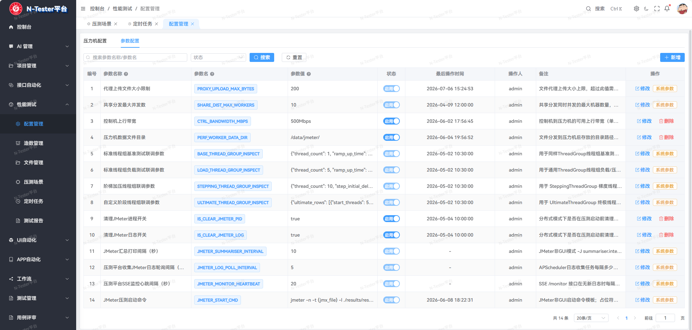

找到需要调整的参数行，点击**编辑**图标修改参数值，保存后**立即生效**，无需重启。

| 参数名称 | 默认值 | 说明                                        |
|---------|--------|-------------------------------------------|
| 后端代理上传文件大小上限 | 200MB | <=该大小的文件平台机代理上传，超过自动切换为直预签名传模式（减轻平台机IO压力） |
| 压力机工作目录 | `data/jmeter/` | 文件分发后在压力机上的存放路径（包括数据文件、日志文件、报告临时存储目录等）    |
| 共享分发最大并发节点数 | 10 | 同时向多少台压力机推送文件（建议不做修改）                     |
| 平台机上行带宽 | 500Mbps | 按实际带宽填写，影响并发分发数量（需要修改为实际带宽）               |
| JMeter 统计打印间隔 | 10s | JMeter 每隔多少秒输出一次统计日志（建议不做修改）              |
| 日志收集轮询间隔 | 5s | 平台拉取 JMeter 日志的频率，建议小于统计间隔（建议不做修改）        |
| SSE 监控心跳间隔 | 20s | 无新日志时保持前端连接的心跳频率（建议不做修改）                  |

> 📍 菜单路径：性能测试 → 配置管理 → 参数配置 → 【新增】
>
> 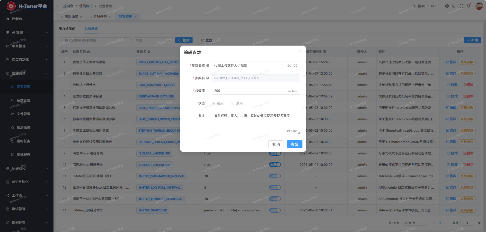

---

### 1.2 压力机配置

> 📍 菜单路径：性能测试 → 配置管理 → 压力机配置
>
> 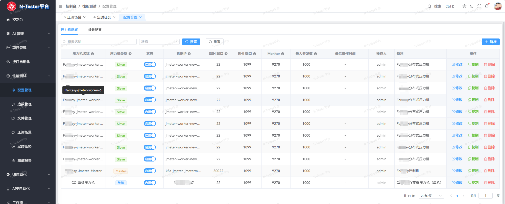

压测前需先在此录入所有压力机信息。根据压测环境选择**单机**或**分布式**模式：

| 模式 | 配置要求 |
|-----|---------|
| **单机** | 配置 1 台"单机"类型压力机，平台直连执行 |
| **分布式** | 配置 1 台 Master + N 台 Slave，Master 与各 Slave 的 RMI 端口（默认 1099）须互通 |

#### 新增压力机
> 📍 菜单路径：性能测试 → 配置管理 → 压力机配置 → 【新增】
> 
> 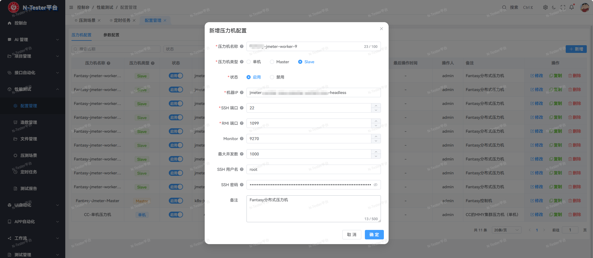

| 字段 | 说明                                       |
|-----|------------------------------------------|
| 名称 | 自定义，如"压力机-01"                            |
| 机器类型 | 单机 / Master / Slave                      |
| IP 地址 | 机器 IP 或域名                                |
| SSH 端口 | 默认 22                                    |
| RMI 端口 | 默认 1099，仅 Master/Slave 需填                |
| SSH 用户名/密码 | 备用认证，优先使用服务器配置的 SSH 密钥，不通时降级使用密码登录（建议填写） |

> ⚠️ 分布式模式下 Master 与各 Slave 之间 RMI 端口须互通，否则 JMeter 分布式通信会失败。

---

## 二、文件管理

> 📍 菜单路径：性能测试 → 文件管理
>
> 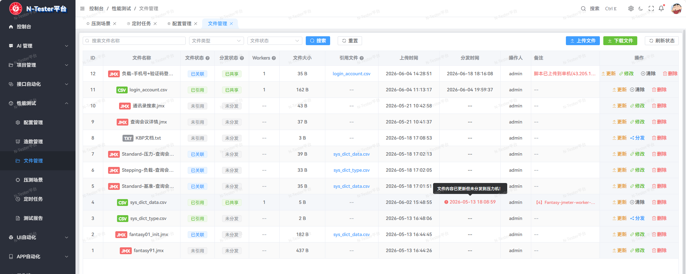

---

### 2.1 上传文件

点击**上传文件**，选择本地文件（支持 jmx、csv、txt、json、yaml 等格式）。
> 性能测试 → 文件管理 → 【上传文件】
> 
> 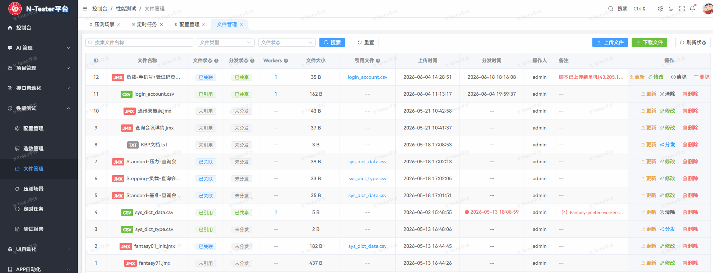

- 文件 ≤ 200MB：平台代理上传，完成后状态变为**已完成**。
- 文件 > 200MB：浏览器直传 MinIO，不占用平台带宽，完成后状态同样变为**已完成**。

> ⚠️ 大文件上传中途关闭页面，状态会停留在**待上传**，需重新上传或手动删除记录。

---

### 2.2 关联引用

CSV 等数据文件上传后，需手动将其**关联到对应的 JMX 脚本**，场景联调时系统才能识别该文件是否已分发。
> 性能测试 → 文件管理 → 【修改（关联引用文件）】
> 
> 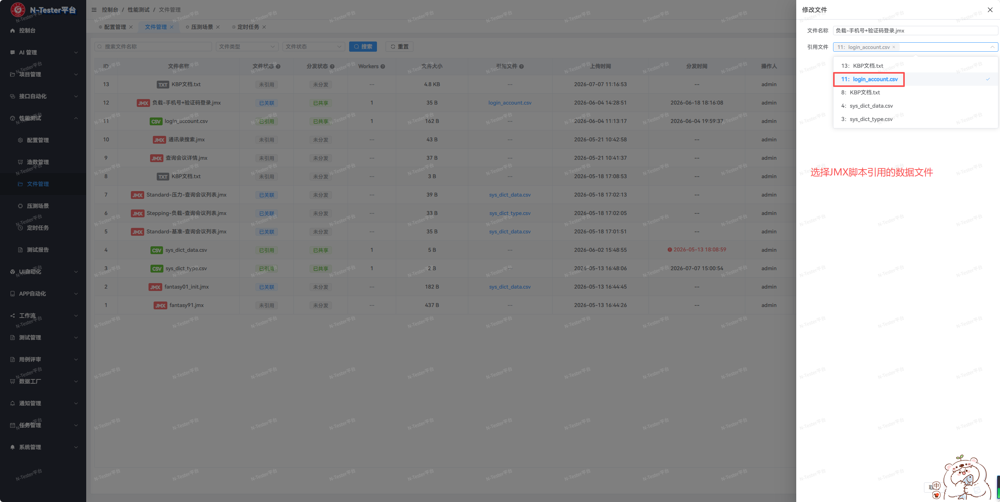

**操作步骤：**
1. 在文件列表选择 JMX脚本 文件，点击**修改**按钮。
2. 在引用文件下拉列表选择要引用的 数据文件。
3. 确认后，文件引用状态变为**已引用**；JMX脚本的引用文件列表显示该数据文件名，状态**已关联**。

> ⚠️ 替换了 JMX 脚本后，需重新关联对应的 CSV 文件。

---

### 2.3 文件分发

文件上传完成后，需将其**分发到各压力机**，压测时才能使用。在文件列表点击**分发**，选择分发方式：

#### 共享分发

每台压力机获得**完整文件副本**，适用于所有机器使用相同数据的场景。
> 性能测试 → 文件管理 → 【分发】
> 
> 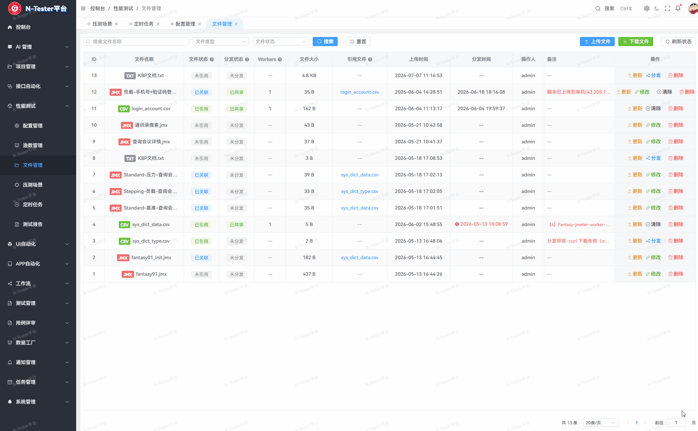

1. 分发方式选择**共享分发**，选择目标压力机数量。
2. 系统自动选择传输路径，实时显示各节点进度。
3. 全部成功后分发状态变为**已共享**。

#### 分割分发

将文件按压力机数量**等比切割**，每台机器得到独立分片，数据不重叠。适用于所有压力机依赖独立数据源的场景（如账号登录等，避免抢登录情况）。

🖼️ *[配图预留：分割分发进度界面]*

> ⚠️ 分割分发按字节切割，不识别行边界，CSV 末行可能被截断。至少需要 2 台压力机。

#### 清除分发

删除压力机上已分发的文件（不会删除MinIO中的数据对象），分发状态重置为**未分发**。
>
> 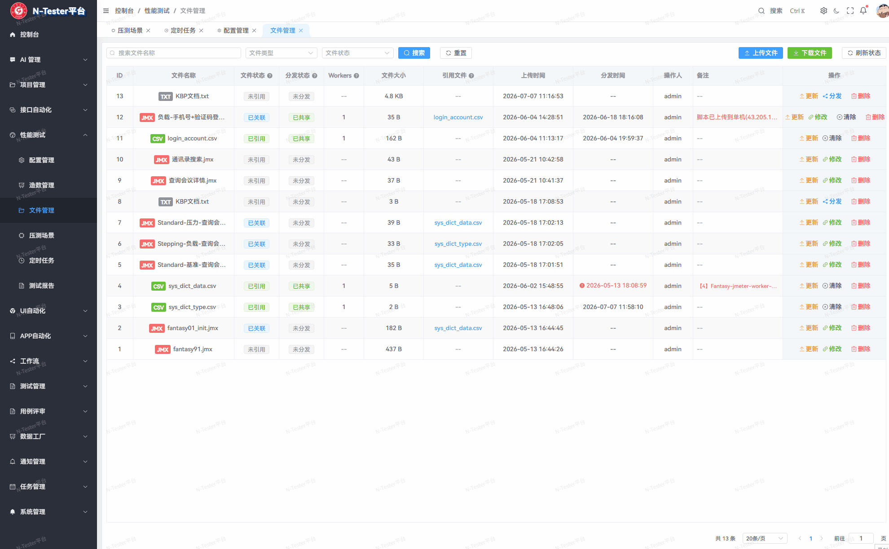

---

### 2.4 替换与删除文件

**替换：** 点击**替换**按钮上传新文件，场景关联关系保持不变，分发状态重置为**未分发**，需重新分发。

**删除：** 软删除，MinIO 上的文件同步删除。已被场景关联的文件删除后，场景需重新绑定脚本。

---

## 三、压测场景

> 📍 菜单路径：性能测试 → 压测场景
>
> 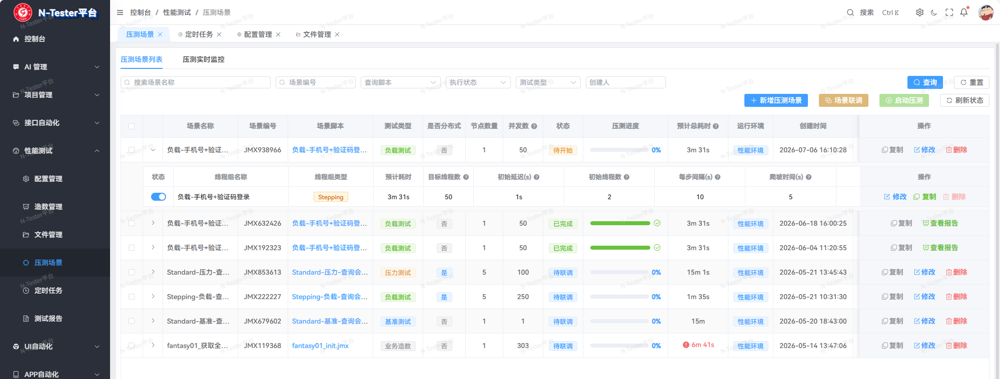

**操作流程：**

```
新建场景 → 配置子配置 → 场景联调 → 正式启动 → 实时监控 → 停止
```

---

### 3.1 新建场景
> 性能测试 → 压测场景 → 【新建压测场景】
> 
> 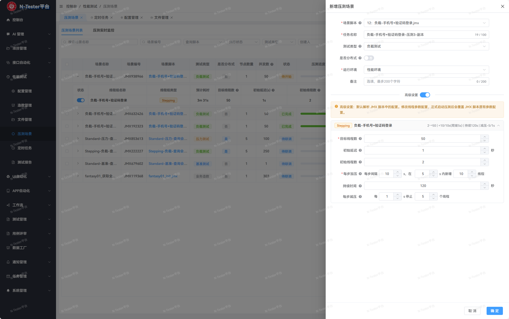

| 字段 | 说明                                    |
|-----|---------------------------------------|
| 场景名称 | 自定义描述，如"登录接口-负载测试"                    |
| 测试类型 | 基础测试 / 负载测试 / 压力测试 等                  |
| 运行环境 | 开发 / 测试 / 预发布 / 生产 / 性能               |
| 关联 JMX 脚本 | 从已上传的文件中选择，选定后自动解析JMX脚本线程组信息（高级设置中可见） |
| 执行模式 | 单机 / 分布式                              |
| 节点数量 | 仅分布式模式需填，对应 Slave 台数                  |

> 场景编号由系统自动生成（格式：JMX + 6 位随机数），不可手动指定。
> 当前场景脚本仅支持自动解析的线程组类型：ThreadGroup、SteppingThreadGroup和UltimateThreadGroup。

---

### 3.2 配置子配置（线程组参数）

场景创建后系统自动根据 JMX 中的线程组生成子配置，点击**编辑**填写正式压测参数。
> 性能测试 → 压测场景 → 场景子配置(展开) → 【复制/修改】 
> 
> 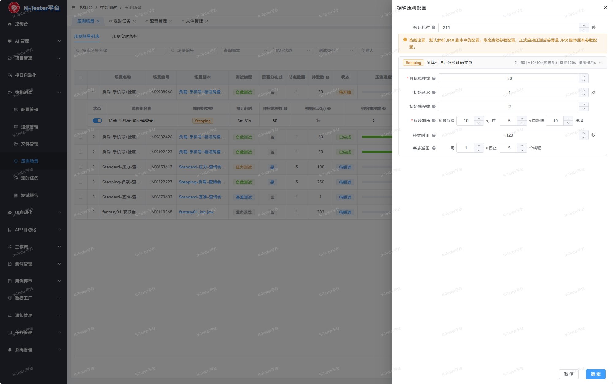
> 场景父列表：仅支持修改场景基本信息；场景子列表：仅支持修改场景线程组配置等信息。

#### 标准线程组（ThreadGroup）

| 参数 | 说明 |
|-----|------|
| 线程数（单节点） | 每台压力机的虚拟用户数，总并发 = 线程数 × 节点数 |
| Ramp-up 时间（秒） | 所有线程从 0 到满并发所需时间，0 = 同时全部启动 |
| 循环次数 | 每个线程执行的循环次数 |
| 永远循环 | 勾选后持续执行至"持续时间"到期 |
| 持续时间（秒） | 勾选永远循环时必填 |
| 启动延迟（秒） | 该线程组延迟多少秒后开始 |

#### 阶梯加压（SteppingThreadGroup）

| 参数 | 说明 |
|-----|------|
| 最大线程数 | 压测达到的最大并发数 |
| 每步新增线程数 | 每阶梯新增数量 |
| 每步时间间隔（秒） | 两个阶梯之间的间隔 |
| 保持满载时间（秒） | 达到最大并发后持续执行的时长 |
| 爬坡时间（秒） | 每步线程的启动持续时间 |

#### 自定义阶段（UltimateThreadGroup）

通过行列表自定义每个压测阶段的并发曲线，每行填写：线程数 / 初始延迟 / 爬坡时间 / 保持时间 / 停止时间。

> 同一场景可混用多种线程组类型，系统按类型逐一写入。

---

### 3.3 场景联调（调试）

> 联调用于正式压测前以极低并发（预置参数，如 1 线程 1 循环）验证 JMX 脚本是否正常运行。
>
> **前置条件**：场景状态为**待联调**。


点击**场景联调**，系统先展示**调试检查面板**：

| 检查项 | 说明 |
|-------|------|
| 使用的变量 | JMX 中引用的自定义变量 |
| 接口列表 | JMX 中所有 HTTP 采样器 |
| 线程组配置 | 联调阶段注入的预置参数预览 |
| 数据文件 | JMX 引用的 CSV 是否已上传并分发 |
| 调试组件 | 未关闭的调试类组件，标记为**警告**，正式压测启动时将自动关闭 |
| 前置检查 | SSH 连通性、JMeter 可用性等 |
| 服务可达性 | 目标服务地址是否可访问 |

确认无误后点击**开始联调**，实时查看日志输出：

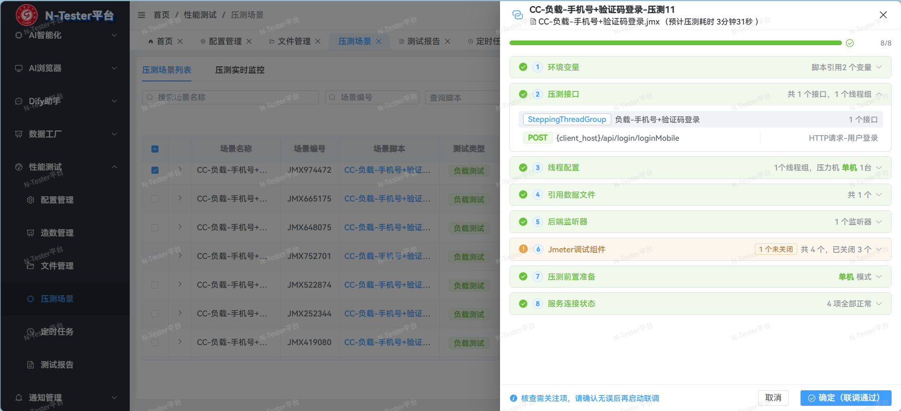

- 执行成功 → 场景状态变为**待开始**，可进行正式压测。
- 执行失败 → 根据日志排查，修复后可重复联调。
- 联调结果面板：异常信息红色标识，需要重点核实无误，方可启动压测。

> **单机**：JMX 直接上传到单机压力机执行。
>
> **分布式**：JMX 上传到 Master，由 Master 控制各 Slave 执行。

---

### 3.4 正式启动压测

> **前置条件**：场景状态为**待开始**（已完成联调）。


点击**开始压测**，系统依次执行：

1. **写入正式参数**：将子配置中的线程组参数注入 JMX，并自动关闭遗留的调试组件。
2. **上传 JMX 到压力机**。
3. **后台启动 JMeter**：启动成功后场景变为**进行中**，自动跳转实时监控。

| 步骤 | 单机 | 分布式 |
|-----|------|--------|
| JMX 上传 | 直接到单机压力机 | 上传到 Master，Slave 由 Master 同步 |
| JMeter 启动 | SSH 到单机执行 | SSH 到 Master，带各 Slave 地址参数 |
| 日志收集 | 从单机拉取 | 从 Master 及各 Slave 分别拉取 |

---

### 3.5 实时监控

> 场景**进行中**后自动进入，也可从场景列表点击**监控**按钮进入。

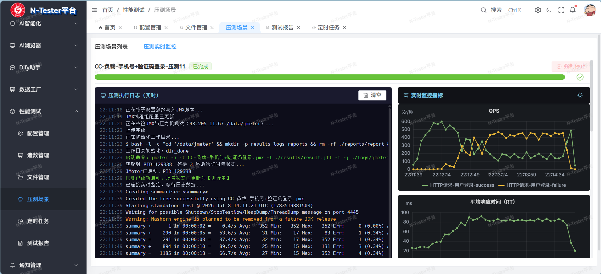
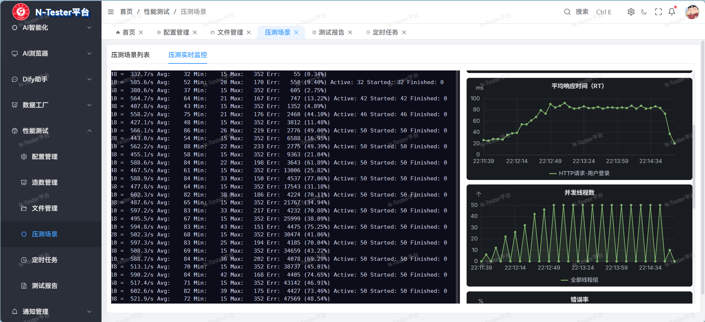
**实时日志**：左侧展示 JMeter 控制台增量日志，支持断线续传。

**实时指标看板（右侧）**：

| 指标 | 说明 |
|-----|------|
| QPS | 每秒请求吞吐量 |
| 平均响应时间（RT） | 当前统计周期内的平均响应时间（ms） |
| 并发线程数 | 当前活跃线程数 |
| 错误率 | 当前统计周期内的请求错误比例 |

**Top 5 错误**：实时展示错误量最多的前 5 个采样器及错误原因，点击可放大查看。
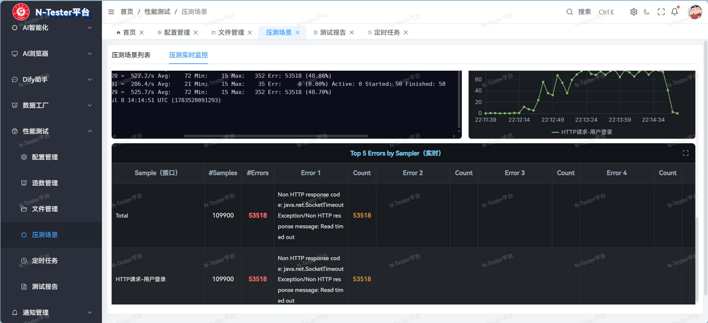
---

### 3.6 停止压测

在监控界面或场景列表点击**停止**，JMeter 进程退出，场景状态变为**已完成**或**已取消**。

> 停止后如需收集报告，前往测试报告页面手动触发。

---

## 四、定时任务

> 📍 菜单路径：性能测试 → 定时任务

定时任务用于在指定时间**自动触发压测场景**，等同于手动点击"开始压测"。

> ⚠️ 关联的场景必须处于**待开始**状态（已完成联调），否则任务触发时会失败。

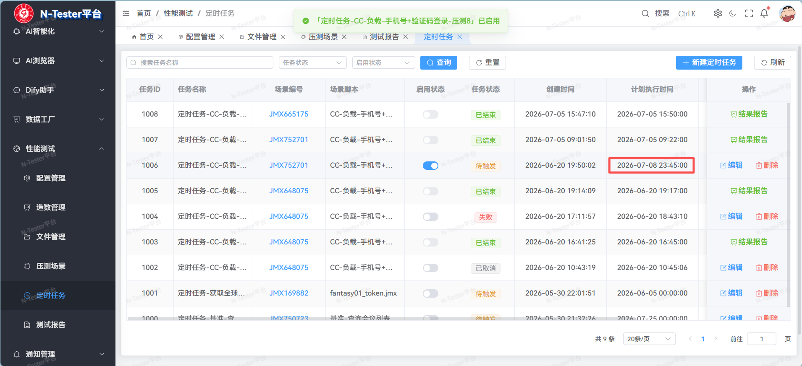

**新建定时任务：**

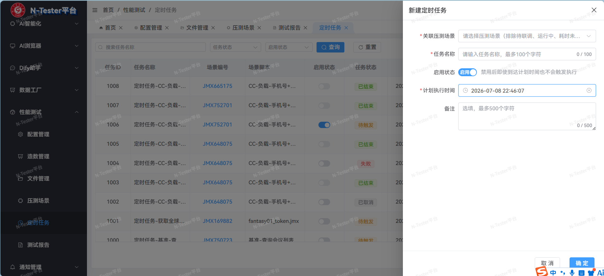

| 字段 | 说明 |
|-----|------|
| 任务名称 | 自定义描述 |
| 关联压测场景 | 下拉只显示状态为**待开始**的场景 |
| 计划执行时间 | 精确到秒，如 2026-07-10 02:00:00 |
| 是否启用 | 关闭后到时不会触发 |

**任务状态：**

| 状态 | 可执行操作 |
|-----|-----------|
| 待触发 | 修改、删除、禁用 |
| 进行中 | 取消 |
| 已结束 | 查看（只读） |
| 已取消 / 失败 | 修改、删除 |

🖼️ *[配图预留：定时任务状态流转示意图]*

---

## 五、测试报告

> 📍 菜单路径：性能测试 → 测试报告

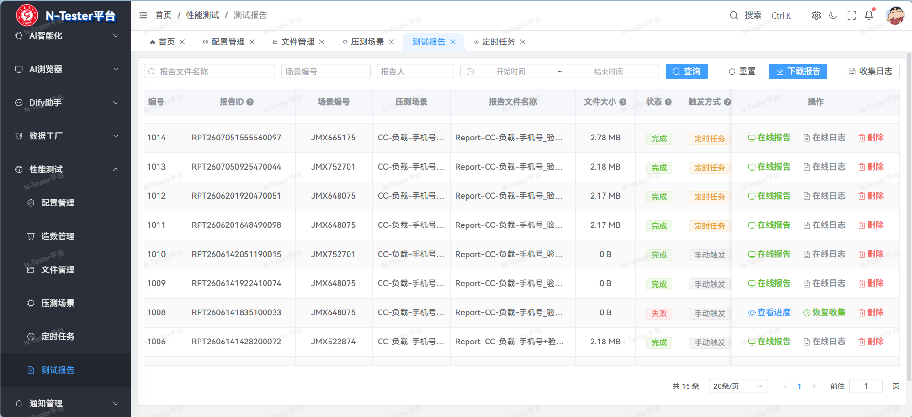

---

### 5.1 收集报告

压测结束后（状态为**已完成**或**已取消**），点击**收集报告**，实时查看收集进度。

🖼️ *[配图预留：报告收集进度界面]*

收集步骤：从执行机拉取日志和 JTL 结果文件 → 生成 HTML 报告 → 上传 MinIO 归档。

> **分布式模式**：分别从 Master 和各 Slave 拉取日志，合并后统一归档。
>
> 中断的收集任务可点击**恢复收集**继续。

---

### 5.2 查看与下载报告
> 性能测试 → 测试报告 → 【在线报告】
> 
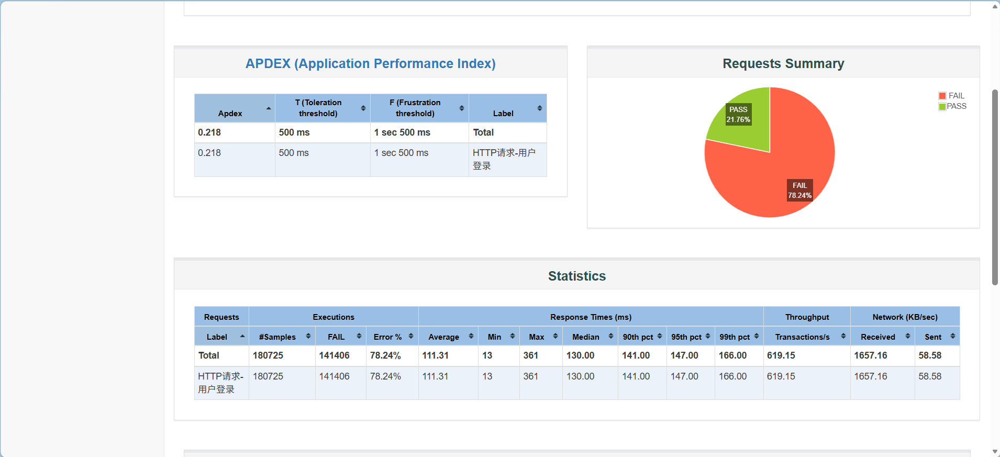
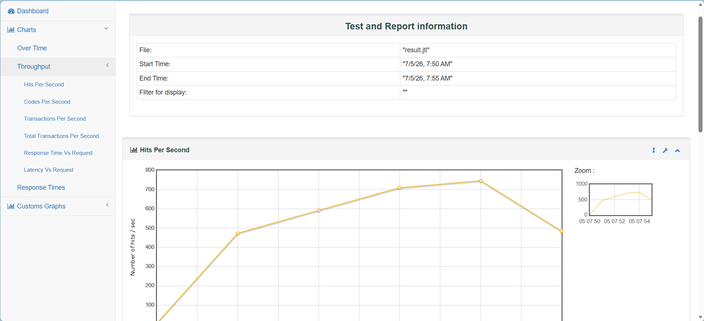
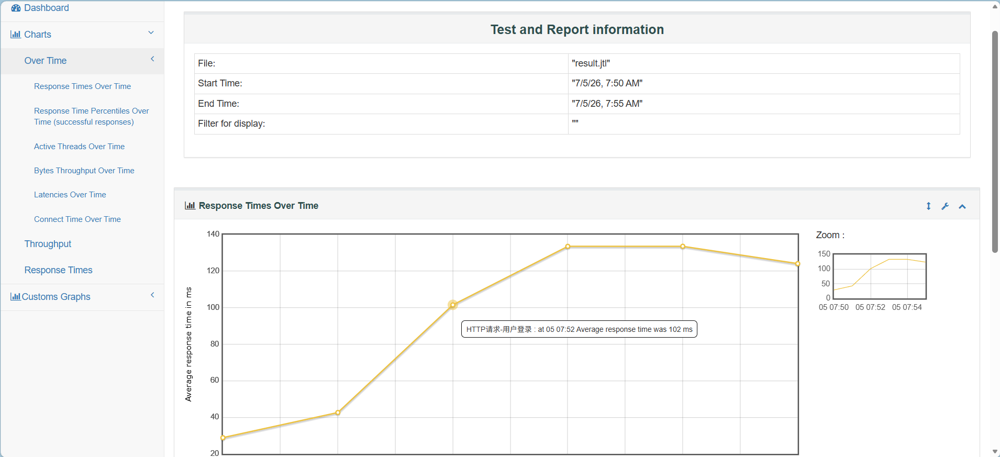

| 操作 | 说明 |
|-----|------|
| **预览** | 在新标签页打开 JMeter HTML 报告，含响应时间分布、吞吐量曲线、各采样器汇总（P50/P90/P95/P99）等 |
| **日志** | 查看 JMeter 控制台日志或报告收集日志；分布式可按节点切换 |
| **下载** | 下载 HTML 报告、JMeter 日志、JTL 结果文件，多文件自动打包为 ZIP |

### 5.3 在线日志

> 性能测试 → 测试报告 → 【在线日志】
> 
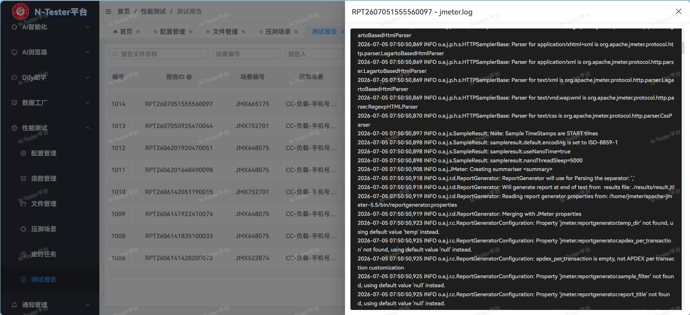
> 支持查看压测过程中的Jmeter实时运行日志（即jmeter.log）。
---

## 附录：常用术语

| 术语 | 说明 |
|-----|------|
| **JMX** | JMeter 脚本文件（XML 格式） |
| **JTL** | JMeter 测试结果文件，记录每条请求的响应详情 |
| **Ramp-up** | 线程爬坡时间，所有虚拟用户从 0 启动到满并发所需时间 |
| **Master** | 分布式压测控制机，负责协调 Slave 执行 |
| **Slave / Worker** | 分布式压测执行机，实际发出请求的机器 |
| **RMI** | JMeter 分布式通信协议，Master 通过此协议控制 Slave |
| **SSE** | 服务器向前端实时推送进度和日志的技术 |
| **P95 / P99** | 百分位响应时间，如 P95 = 95% 的请求响应时间低于该值 |
| **TPS / QPS** | 每秒事务数 / 每秒请求数，衡量系统吞吐量的核心指标 |

---

*文档版本：v1.1 | 最后更新：2026-07-08*
